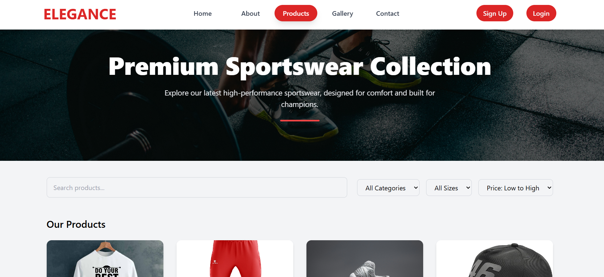
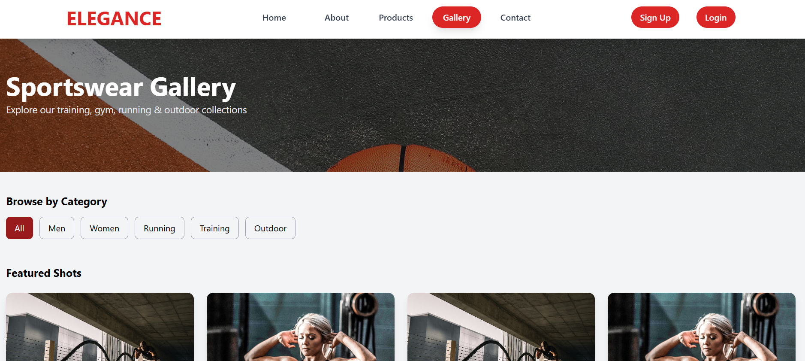
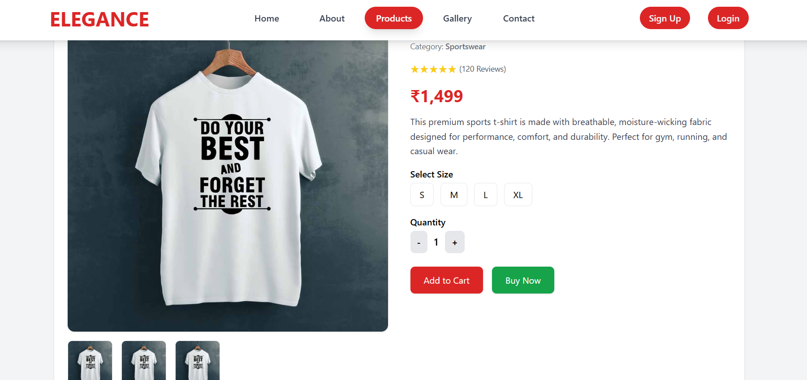
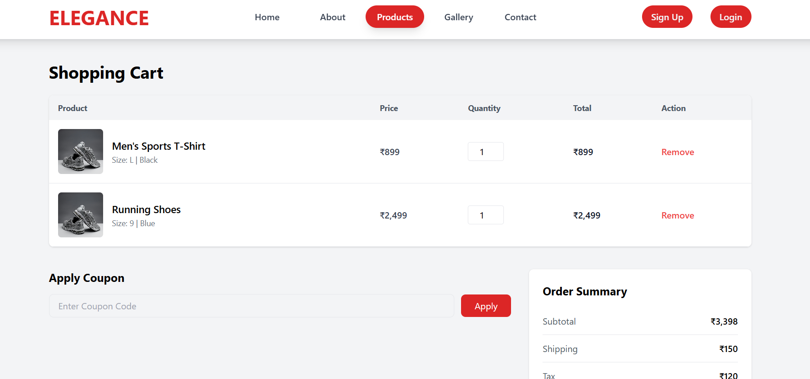
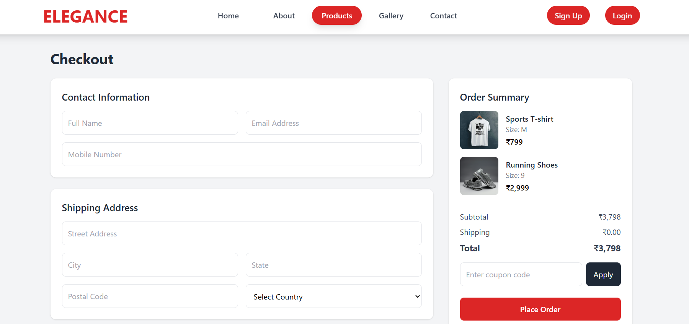

# 🏀 Sportswear E-Commerce Website

A modern, responsive Sportswear E-commerce platform built using Laravel, PostgreSQL, and TailwindCSS.
This project is currently under development and aims to provide a smooth shopping experience with features like product listings, filtering, cart system, checkout flow, authentication, and more.

---

### ✨Features  (Planned / Ongoing)

* Product listing & product details page
* Dynamic categories & filtering
* Cart system (Add/Remove/Update quantity)
* Checkout flow (shipping, billing, payment UI)
* Coupon code UI
* Order summary & confirmation screen
* Secure authentication (Login/Register/Forgot Password)
* User Dashboard
* Admin dashboard (manage products, orders, users)
* Wishlist system
* Reviews & Ratings

---

## 🛠 Tech Stack

| Layer        | Technology                                         |
| ------------ | -------------------------------------------------- |
| **Backend**  | Laravel 12                                         |
| **Frontend** | Blade Templates + Tailwind CSS                     |
| **Database** | PostgreSQL                                         |
| **Auth**     | Custom Authentication                              |
| **ORM**      | Laravel Eloquent                                   |
| **Storage**  | Laravel File Storage                               |

---

## 🖼️ Screenshots

| Page                  | Preview                                                   |
| --------------------- | --------------------------------------------------------- |
| Home Page             |                         |
| About Page            |                       |
| Products Page         |                 |
| Gallery Page          |                   |
| Contact Page          |                   |
| Product Details Page  |   |
| Cart Page             |                         |
| Checkout Page         |                 |

---

## ⚙️ Installation & Setup

### 1️⃣ Clone the repository

```bash
git clone https://github.com/ganeshkannanpm/Sportswear-E-Commerce-Laravel.git
cd Sportswear-E-Commerce-Laravel
```

### 2️⃣ Install dependencies

```bash
composer install
npm install && npm run build
```

### 3️⃣ Environment setup

```bash
cp .env.example .env
php artisan key:generate
```

### 4️⃣ Configure database

For PostgreSQL, update your .env:

```
DB_CONNECTION=pgsql
DB_HOST=127.0.0.1
DB_PORT=5432
DB_DATABASE=your_database_name
DB_USERNAME=your_username
DB_PASSWORD=your_password

```
### 5️⃣ Run migrations

```bash
php artisan migrate
```

### 6️⃣ Start server

```bash
php artisan serve
```
---